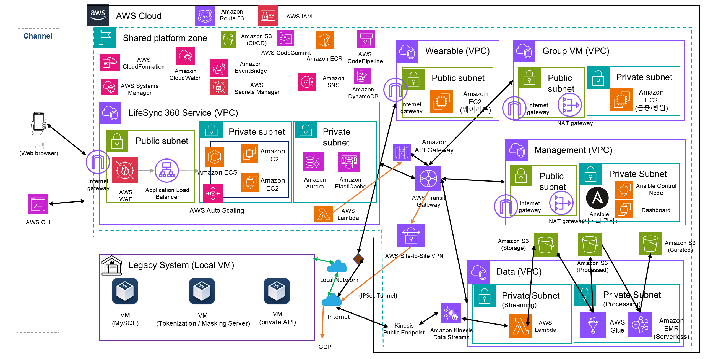
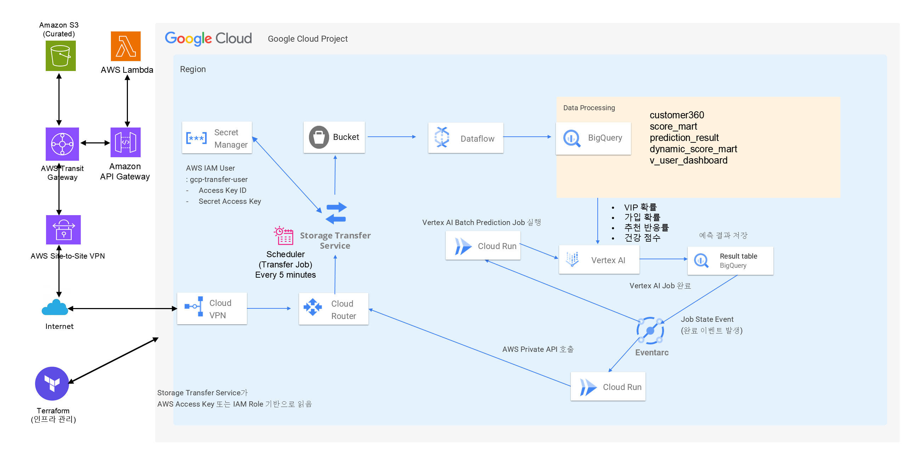

# LifeSync360 (2조 · Antique Archive)

AWS·GCP·온프레미스를 잇는 하이브리드 멀티클라우드 고객 데이터 플랫폼.
클라우드에서 온프레미스 고객 DB를 조회해 고객 프로파일·건강점수·교차판매 추천을 처리한다.

## 아키텍처

### AWS (Hybrid + Multi Cloud)

- **AWS** — ECS(Flask 앱) · Aurora · DynamoDB · Lambda(온프렘 연동/집계) · VPC·TGW·VPN
- **On-Prem** — 고객 원천 DB(MySQL)·토큰화/마스킹 서버, Site-to-Site VPN으로 AWS와 연동

### GCP

- **데이터 파이프라인** — GCS Bucket → Dataflow → BigQuery → Vertex AI(배치 예측)
- **연동** — Storage Transfer Service로 AWS S3 적재, Cloud VPN으로 AWS와 연결
